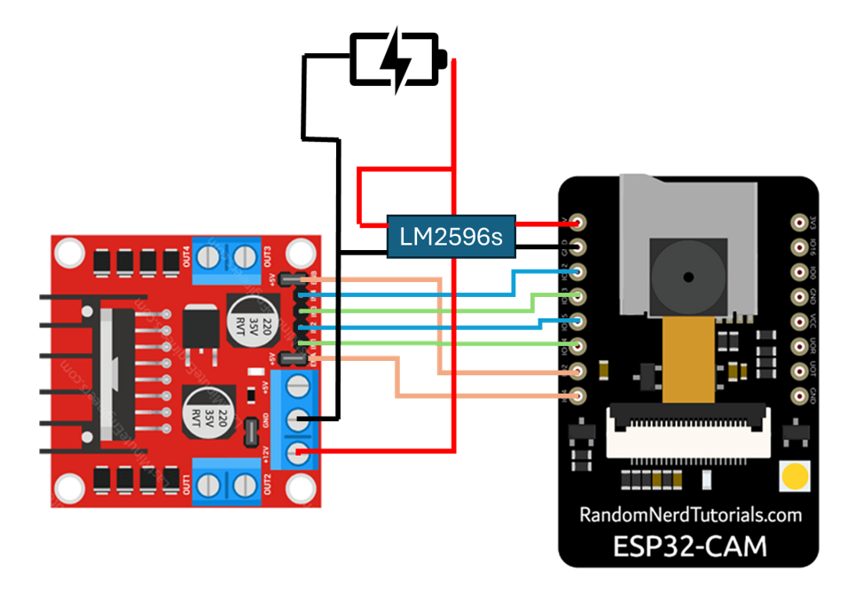

# Control the remote car using gesture
Learn about MCUs by using **ESP32-CAM** and use **OpenCV** recognize the hand gestures.

- [Control the remote car using gesture](#control-the-remote-car-using-gesture)
  - [📸 Illustrative image](#-illustrative-image)
  - [📋 Guideline](#-guideline)
    - [🛠 Preparation](#-preparation)
    - [📥 Installation](#-installation)
  - [🚀 Features](#-features)


## 📸 Illustrative image
## 📋 Guideline
### 🛠 Preparation
1. **Install library needed for OpenCV:**

    ```bash
    pip install opencv-python mediapipe requests
    ```
2. **IDE: PlatformIO**
### 📥 Installation
1. **Clone the repository**
    ```bash
    git clone https://github.com/tongochona/remote_control_car.git
    ```
2. **Open PlatformIO** and import folder
3. **Configure Wi-fi**
   
    - Repalace your **SSID** and **password**
4. **Build and flash the ESP32-CAM**
5. **Switch monitor terminal** and retrieve **ESP's IP address**
6. Schematic Diagram

    
    | L298N Motor Driver | ESP32-CAM |
    |--------------------|-----------|
    | IN1 | GPIO 14|
    | IN2 | GPIO 15|
    | IN3 | GPIO 14|
    | IN4 | GPIO 12|
    | EN A | GPIO 4|
    | EN B | GPIO 2|

7. Ensure your computer is on same network as ESP32-CAM 
   - Open brower and enter **ESP's IP address** to watch video stream and control the car via the web interface
8. Replace **ESP's IP address** in python code and run it.

Now, you can control by hand gesture!

## 🚀 Features ##
- 🤚 Hand Gesture Recognition using OpenCV
- 📹 Live Video Stream by ESP32-CAM
- 🖱 Remote control via Web interface or Hand Gesture


